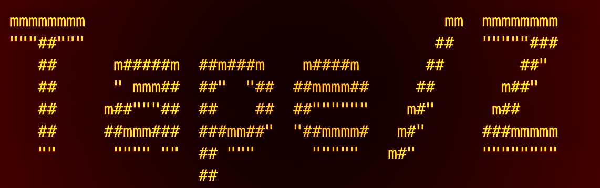
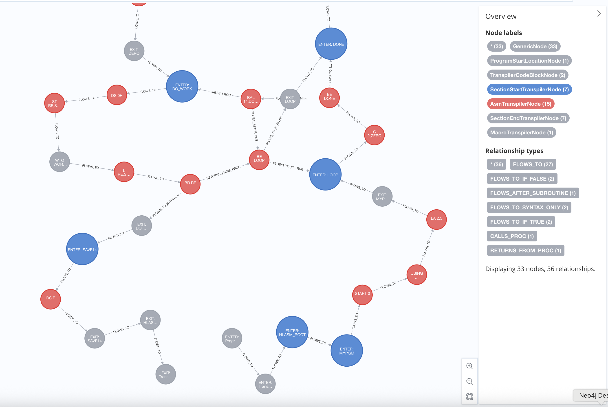

# Tape/Z

[](https://opensource.org/licenses/MIT)
[](https://adoptium.net/en-GB/temurin/releases/)
[](https://maven.apache.org/)

## Tools for Assembly Program Exploration for Z/OS



Tape/Z is an evolving toolkit for analysing mainframe HLASM (High Level Assembler) code. The library provides capabilities for working with mainframe assembler code, including parsing, control flow graph building, dependency tracing, and flowchart visualization capabilities.

## Table of Contents
- [Project Overview](#project-overview)
- [Getting Started](#getting-started)
- [Programmatic Usage](#programmatic-usage)
- [CLI Usage](#cli-usage)
- [Workflow](#workflow)
- [Analysis Pipeline](#analysis-pipeline)
- [Useful Neo4J Queries](#useful-neo4j-queries-for-my-own-reference)
- [Contributing](#contributing)
- [Reporting Issues](#reporting-issues)
- [A Note on Copyright](#a-note-on-copyright)
- [License](#license)


## Project Overview

Tape/Z is designed to parse, analyse, and process HLASM (High Level Assembler) code, which is commonly used in mainframe environments. The project uses ANTLR4 to define the grammar for HLASM instructions and provides tools for working with parsed HLASM code.

**Philophically, this is more of a set of tools intended for use in your own projects.**

Internally, it uses many of the same components and class infrastructure from [Cobol-REKT](https://github.com/avishek-sen-gupta/cobol-rekt), and is intended to be a sibling project to that one.

### Key Features

- **HLASM Parsing**: Parses HLASM code including labels, instructions, operands, and comments
- **Embedded SQL Support**: Recognizes and parses DB2 SQL statements embedded in HLASM code
- **Macro Expansion**: Handles macro definitions and expansions, including copybook inclusion
- **Control Flow Analysis**: Builds control flow graphs (CFG) to visualize program execution paths
- **Dependency Tracing**: Identifies and tracks dependencies between HLASM modules
- **Cyclomatic Complexity**: Calculates cyclomatic complexity metrics for code sections
- **Neo4J Integration**: Stores analysis results in Neo4J graph database for advanced querying
- **API Access**: Provides Model Context Protocol (MCP) server for programmatic access to analysis capabilities

## Getting Started

### Prerequisites

Before you begin, ensure you have the following installed:
- Java 21 or higher
- Maven 3.6 or higher
- Neo4J (optional, for graph storage)

### Installation

1. Clone the repository:
   ```bash
   git clone --recurse-submodules -j8 https://github.com/avishek-sen-gupta/tape-z.git
   cd tape-z
   ```

Or, if you have already cloned the repository without submodules, you can use:

```
git submodule update --init --recursive
```

2. Build the project:
   ```bash
   mvn clean install
   ```

3. Set up environment variables for Neo4J (if using):
   ```bash
   export NEO4J_URI=bolt://localhost:7687
   export NEO4J_USERNAME=neo4j
   export NEO4J_PASSWORD=your_password
   ```

4. (Optional) Install Neo4J:
    - Download from [Neo4J Download Page](https://neo4j.com/download/)
    - Follow the installation instructions for your platform
    - Start the Neo4J server before running any code which needs Neo4J integration

## Programmatic Usage

### Control Flow Graph
- See ```HLASMCFGMain``` for running the analysis pipeline.
- The ```HlasmCodeAnalysisResult``` structure contains the following important results:
    - ```controlFlowGraph``` is the Control Flow Graph.
    - ```complexitiesByLabel``` contains a map of sections and their cyclomatic complexities.
    - ```flattened``` contains the list of all instructions. These are ```TranspilerInstructions``` with the appropriate ```TranspilerNode``` instances.
    - ```dependencyMap``` contains the call relations between different HLASM programs. The technique for determining what constitutes a call to an external program is still somewhat specific, and will be refined later.
- Use ```ExportCFGToNeo4JTask``` to export the CFG to Neo4J.



### Flowchart

- See ```HLASMFlowchartMain``` to see how to build a flowchart.
    - Pass in a ```VerbatimBasicBlockTextMaker``` instance if you do not wish to use AI summarise. Otherwise, pass in an ```AIBasicBlockTextMaker``` instance.
    - Use ```ExportFlowchartToNeo4JTask``` to export the flowchart to Neo4J.

## CLI Usage

Tape/Z provides a command-line interface (CLI) built with PicoCLI that offers multiple commands for analysing and visualizing HLASM code, through the ```tapez-cli``` JAR. These outputs can be used for further analysis, visualization, or integration with other tools.

#### Available Commands

The CLI provides the following commands:

1. **cfg-to-json**: Exports the Control Flow Graph (CFG) to JSON
2. **flowchart**: Builds a flowchart for the entire program in one go
3. **flowchart-sections**: Builds flowcharts for all sections of the program, section by section

### Command: cfg-to-json

This command analyses a HLASM file and exports its control flow graph to JSON format.

**Parameters:**
- Path to the HLASM file to analyse (positional parameter)
- `-c, --copybook`: Path to the copybook directory (required)
- `-o, --output`: Path where the output JSON file will be written (required)
- `-e, --external`: Path for external programs (required)

**Example:**
```bash
java -jar tapez-cli/target/tapez-cli-1.0-SNAPSHOT.jar cfg-to-json /path/to/my/hlasm/file.txt -c /path/to/copybook/directory -o /path/to/output/cfg.json -e /path/to/external/programs
```

### Command: flowchart

This command builds a flowchart visualization for the entire HLASM program.

**Parameters:**
- HLASM program name to analyse (positional parameter)
- `-s, --srcDir`: The HLASM source directory (required)
- `-cp, --copyBooksDir`: Copybook directory (required)
- `-o, --outputDir`: Output directory (required)
- `-e, --external`: Path for external programs (required)
- `-m, --model`: Foundation model to use (optional)

**Example**

```bash
OLLAMA_ENDPOINT=http://<ollama.endpoint> java -jar tapez-cli/target/tapez-cli-1.0-SNAPSHOT.jar flowchart -s /path/to/source/dir -cp /path/to/copybook/dir -o /path/to/output/dir -e /path/to/external/programs -m OLLAMA program.txt
```

NOTE: The command above requires an Ollama endpoint to be running to summarise the contents of the flowchart blocks. If you don't wish to do the summarisation, leave out the ```-m``` parameter.


### Command: flowchart-sections

This command builds flowcharts for all sections of the HLASM program, section by section.

**Parameters:**
- HLASM program name to analyse (positional parameter)
- `-s, --srcDir`: The HLASM source directory (required)
- `-cp, --copyBooksDir`: Copybook directory (required)
- `-o, --outputDir`: Output directory (required)
- `-e, --external`: Path for external programs (required)
- `-m, --model`: Foundation model to use (optional)

**Example:**

```bash
OLLAMA_ENDPOINT=http://<ollama.endpoint> java -jar tapez-cli/target/tapez-cli-1.0-SNAPSHOT.jar flowchart-sections -s /path/to/source/dir -cp /path/to/copybook/dir -o /path/to/output/dir -e /path/to/external/programs -m OLLAMA program.txt
```

### CLI Help

To see all available commands and general help information:

```bash
java -jar tapez-cli/target/tapez-cli-1.0-SNAPSHOT.jar --help
```

To see help for a specific command:

```bash
java -jar tapez-cli/target/tapez-cli-1.0-SNAPSHOT.jar <command> --help
```

## Workflow

The typical workflow is:
1. HLASM code is parsed using the grammar from hlasm-parser and hlasm-format-loader
2. The parsed code is analysed by hlasm-graph-loader using algorithms from mojo-common to build control flow graphs
3. The analysis results are stored in Neo4J using the woof module
4. The hlasm-mcp-server provides API access to the analysis capabilities and results

## Analysis Pipeline

The library processes code through a pipeline which runs multiple passes on the code:

- **File Reading**: The source HLASM file is read line by line.
- **Line Truncation**: Lines are truncated beyond column 72, following HLASM standards.
- **Macro Expansion**: Macros are expanded, and copybooks are included.
- **Label Block Extraction**: Labeled blocks are identified and extracted.
- **Line Continuation Handling**: Continued lines are collapsed into single logical lines.
- **HLASM Parsing**: The code is parsed using the ANTLR4-generated parser.
- **SQL Parsing**: Embedded SQL statements are identified and parsed.
- **Macro Processing**: Both structured and unstructured macros are processed.
- **External Call Resolution**: External calls to other modules are resolved.
- **Dependency Tracking**: Dependencies between modules are identified and tracked.
- **Code Flattening**: The hierarchical code structure is flattened for analysis.
- **Control Flow Graph Generation**: A control flow graph is built from the flattened code.
- **Cyclomatic Complexity Calculation**: Complexity metrics are calculated for code sections.
- **Independent Component Identification**: Independent code components are identified.

## Useful Neo4J queries for my own reference

Identify dead code

```
MATCH (n)
WHERE NOT EXISTS {
  MATCH (m)-[r]->(n)
  WHERE type(r) <> 'FLOWS_TO_SYNTAX_ONLY'
}
RETURN n
```

Delete all nodes

```
MATCH (n) DETACH DELETE n
```

Match the whole graph
```
MATCH (n)-[r]->(d) RETURN n,r,d
```

## Contributing

Contributions to Tape/Z are welcome! Here's how you can contribute:

1. Fork the repository
2. Create a feature branch (`git checkout -b feature/amazing-feature`)
3. Commit your changes (`git commit -m 'Add some amazing feature'`)
4. Push to the branch (`git push origin feature/amazing-feature`)
5. Open a Pull Request

Please make sure to update tests as appropriate and follow the existing code style.

## Reporting Issues

If you encounter any bugs or have feature requests, please file an issue on the GitHub repository. When reporting issues, please include:

1. A clear and descriptive title
2. Steps to reproduce the issue, including a clear minimal example HLASM program where this issue occurs
3. Expected behavior
4. Actual behavior
5. Any relevant logs or error messages
6. Your environment (OS, Java version, etc.)

## A Note on Copyright

The DB2 grammar has been graciously borrowed from the [eclipse-che4z COBOL support project](https://github.com/eclipse-che4z/che-che4z-lsp-for-cobol), and thus (together with any changes) falls under the Eclipse Public License v2.0.

The rest of the code falls under the MIT License.

## License

MIT License

Copyright (c) 2025 Avishek Sen Gupta

Permission is hereby granted, free of charge, to any person obtaining a copy
of this software and associated documentation files (the "Software"), to deal
in the Software without restriction, including without limitation the rights
to use, copy, modify, merge, publish, distribute, sublicense, and/or sell
copies of the Software, and to permit persons to whom the Software is
furnished to do so, subject to the following conditions:

The above copyright notice and this permission notice shall be included in all
copies or substantial portions of the Software.

THE SOFTWARE IS PROVIDED "AS IS", WITHOUT WARRANTY OF ANY KIND, EXPRESS OR
IMPLIED, INCLUDING BUT NOT LIMITED TO THE WARRANTIES OF MERCHANTABILITY,
FITNESS FOR A PARTICULAR PURPOSE AND NONINFRINGEMENT. IN NO EVENT SHALL THE
AUTHORS OR COPYRIGHT HOLDERS BE LIABLE FOR ANY CLAIM, DAMAGES OR OTHER
LIABILITY, WHETHER IN AN ACTION OF CONTRACT, TORT OR OTHERWISE, ARISING FROM,
OUT OF OR IN CONNECTION WITH THE SOFTWARE OR THE USE OR OTHER DEALINGS IN THE
SOFTWARE.
