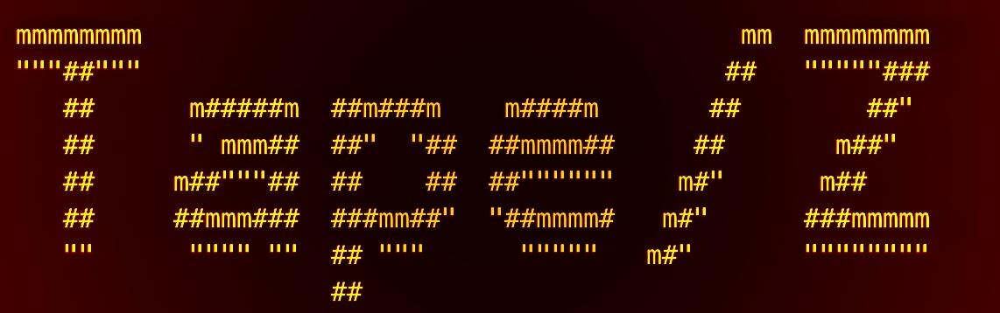

# Tape/Z - Python Edition

[](https://opensource.org/licenses/MIT)
[](https://www.python.org/downloads/)

## Tools for Assembly Program Exploration for Z/OS (Python Implementation)



Tape/Z Python Edition is a complete rewrite of the original Java-based toolkit for analyzing mainframe HLASM (High Level Assembler) code. The library provides capabilities for working with mainframe assembler code, including parsing, control flow graph building, dependency tracing, and flowchart visualization.

## Table of Contents
- [Project Overview](#project-overview)
- [What's New in Python Edition](#whats-new-in-python-edition)
- [Getting Started](#getting-started)
- [Installation](#installation)
- [CLI Usage](#cli-usage)
- [Programmatic Usage](#programmatic-usage)
- [Architecture](#architecture)
- [Neo4J Integration](#neo4j-integration)
- [Contributing](#contributing)
- [License](#license)

## Project Overview

Tape/Z Python Edition is designed to parse, analyze, and process HLASM (High Level Assembler) code, which is commonly used in mainframe environments. The project uses a simplified parser (with plans to integrate ANTLR4) and provides tools for working with parsed HLASM code.

### Key Features

- **HLASM Parsing**: Parses HLASM code including labels, instructions, operands, and comments
- **Embedded SQL Support**: Recognizes and parses DB2 SQL statements embedded in HLASM code
- **Control Flow Analysis**: Builds control flow graphs (CFG) to visualize program execution paths
- **Dependency Tracing**: Identifies and tracks dependencies between HLASM modules
- **Cyclomatic Complexity**: Calculates cyclomatic complexity metrics for code sections
- **Neo4J Integration**: Stores analysis results in Neo4J graph database for advanced querying
- **Flowchart Generation**: Creates visual flowcharts using Graphviz
- **CLI Interface**: Command-line tools built with Click
- **MCP Server**: Model Context Protocol server for API access (basic implementation)

## What's New in Python Edition

### Technology Stack

The Python edition uses modern Python technologies:

- **Python 3.11+** - Modern Python with type hints and dataclasses
- **Poetry** - Dependency management and packaging
- **Click** - Command-line interface framework
- **NetworkX** - Graph data structures and algorithms
- **Neo4J Python Driver** - Graph database integration
- **Graphviz** - Flowchart generation
- **Pydantic** - Data validation and settings management

### Differences from Java Version

1. **Simplified Parser**: Currently uses a regex-based parser instead of ANTLR4 (ANTLR4 integration planned)
2. **NetworkX instead of JGraphT**: Python's NetworkX library for graph operations
3. **Click instead of PicoCLI**: More Pythonic CLI interface
4. **Modern Python Features**: Uses dataclasses, type hints, and context managers
5. **Poetry for Dependency Management**: Instead of Maven

## Getting Started

### Prerequisites

Before you begin, ensure you have the following installed:
- Python 3.11 or higher
- Poetry (recommended) or pip
- Neo4J (optional, for graph storage)
- Graphviz (for flowchart generation)

### Installation

#### Using Poetry (Recommended)

```bash
# Clone the repository
git clone --recurse-submodules -j8 https://github.com/avishek-sen-gupta/tape-z.git
cd tape-z

# Install dependencies
poetry install

# Activate the virtual environment
poetry shell
```

#### Using pip

```bash
# Clone the repository
git clone --recurse-submodules -j8 https://github.com/avishek-sen-gupta/tape-z.git
cd tape-z

# Install in development mode
pip install -e .
```

#### Install Graphviz

For flowchart generation, you'll need Graphviz:

**Ubuntu/Debian:**
```bash
sudo apt-get install graphviz
```

**macOS:**
```bash
brew install graphviz
```

**Windows:**
Download from https://graphviz.org/download/

### Set up Neo4J (Optional)

```bash
export NEO4J_URI=bolt://localhost:7687
export NEO4J_USERNAME=neo4j
export NEO4J_PASSWORD=your_password
```

## CLI Usage

Tape/Z provides a command-line interface with multiple commands for analyzing and visualizing HLASM code.

### Available Commands

1. **cfg-to-json**: Exports the Control Flow Graph (CFG) to JSON
2. **flowchart**: Builds a flowchart for the entire program
3. **flowchart-sections**: Builds flowcharts for all sections of the program

### Command: cfg-to-json

Analyzes a HLASM file and exports its control flow graph to JSON format.

```bash
tapez cfg-to-json /path/to/hlasm/file.txt \
  -c /path/to/copybook/directory \
  -o /path/to/output/cfg.json \
  -e /path/to/external/programs
```

**Options:**
- `FILE_PATH`: Path to the HLASM file to analyze (required)
- `-c, --copybook`: Path to the copybook directory (required)
- `-o, --output`: Path where the output JSON file will be written (required)
- `-e, --external`: Path for external programs (required)

### Command: flowchart

Builds a flowchart visualization for the entire HLASM program.

```bash
tapez flowchart program.txt \
  -s /path/to/source/dir \
  -cp /path/to/copybook/dir \
  -o /path/to/output/dir \
  -e /path/to/external/programs
```

**Options:**
- `PROGRAM_NAME`: HLASM program name to analyze (required)
- `-s, --srcDir`: The HLASM source directory (required)
- `-cp, --copyBooksDir`: Copybook directory (required)
- `-o, --outputDir`: Output directory (required)
- `-e, --external`: Path for external programs (required)
- `-m, --model`: Foundation model to use (optional, for AI summarization)

### Command: flowchart-sections

Builds flowcharts for all sections of the HLASM program, section by section.

```bash
tapez flowchart-sections program.txt \
  -s /path/to/source/dir \
  -cp /path/to/copybook/dir \
  -o /path/to/output/dir \
  -e /path/to/external/programs
```

### CLI Help

To see all available commands:
```bash
tapez --help
```

To see help for a specific command:
```bash
tapez cfg-to-json --help
```

## Programmatic Usage

You can also use Tape/Z as a Python library in your own projects.

### Basic Analysis

```python
from pathlib import Path
from tapez.graph_loader.analysis import CodeAnalyzer

# Create analyzer
analyzer = CodeAnalyzer()

# Analyze a HLASM file
result = analyzer.analyze_file(Path("path/to/program.hlasm"))

# Access results
print(f"Cyclomatic Complexity: {result.cyclomatic_complexity}")
print(f"Total Instructions: {len(result.parse_result.instructions)}")
print(f"Total Labels: {len(result.parse_result.labels)}")

# Access the control flow graph
cfg = result.control_flow_graph
for block_id, block in cfg.blocks.items():
    print(f"Block {block_id}: {len(block.instructions)} instructions")
```

### Building Flowcharts

```python
from pathlib import Path
from tapez.graph_loader.analysis import CodeAnalyzer
from tapez.graph_loader.flowchart import FlowchartBuilder

# Analyze the code
analyzer = CodeAnalyzer()
result = analyzer.analyze_file(Path("program.hlasm"))

# Build flowchart
flowchart_builder = FlowchartBuilder()
output_path = Path("output/flowchart")
flowchart_file = flowchart_builder.build_flowchart(
    result.control_flow_graph,
    output_path,
    format="svg"
)
print(f"Flowchart saved to: {flowchart_file}")
```

### Neo4J Integration

```python
from pathlib import Path
from tapez.graph_loader.analysis import CodeAnalyzer
from tapez.neo4j_integration.exporter import Neo4JExporter
from tapez.neo4j_integration.connection import Neo4JConnection

# Analyze the code
analyzer = CodeAnalyzer()
result = analyzer.analyze_file(Path("program.hlasm"))

# Export to Neo4J
with Neo4JConnection() as connection:
    exporter = Neo4JExporter(connection)
    exporter.export_analysis_result(result, clear_existing=True)
    print("Exported to Neo4J successfully")
```

### Parsing HLASM Code

```python
from pathlib import Path
from tapez.parser.core_parser import HLASMParser

# Create parser
parser = HLASMParser()

# Parse a file
result = parser.parse_file(Path("program.hlasm"))

# Check for errors
if result.success:
    print(f"Parsed {len(result.instructions)} instructions")
    for instruction in result.instructions:
        print(f"{instruction.line_number}: {instruction}")
else:
    print("Parsing errors:")
    for error in result.errors:
        print(f"  - {error}")
```

## Architecture

### Module Structure

```
tapez/
├── __init__.py
├── parser/              # HLASM parsing
│   ├── core_parser.py
│   └── models.py
├── format_loader/       # Instruction format loading
│   ├── instruction_format.py
│   └── mnemonics_loader.py
├── graph_loader/        # CFG building and analysis
│   ├── cfg_builder.py
│   ├── analysis.py
│   └── flowchart.py
├── neo4j_integration/   # Neo4J integration
│   ├── connection.py
│   └── exporter.py
├── cli/                 # Command-line interface
│   ├── main.py
│   └── commands.py
├── mcp_server/          # MCP server (basic)
│   └── server.py
└── common/              # Common utilities
    ├── id_provider.py
    └── file_utils.py
```

### Data Flow

1. **File Reading** → HLASM source file is read and preprocessed
2. **Parsing** → Code is parsed into structured instructions
3. **CFG Building** → Control flow graph is constructed
4. **Analysis** → Metrics and dependencies are calculated
5. **Export** → Results exported to JSON, Neo4J, or flowcharts

## Neo4J Integration

### Useful Neo4J Queries

Identify dead code:
```cypher
MATCH (n)
WHERE NOT EXISTS {
  MATCH (m)-[r]->(n)
  WHERE type(r) <> 'FLOWS_TO_SYNTAX_ONLY'
}
RETURN n
```

Delete all nodes:
```cypher
MATCH (n) DETACH DELETE n
```

Match the whole graph:
```cypher
MATCH (n)-[r]->(d) RETURN n,r,d
```

Find entry blocks:
```cypher
MATCH (n:BasicBlock {is_entry: true})
RETURN n
```

## Development

### Running Tests

```bash
# Using Poetry
poetry run pytest

# Using pip
pytest
```

### Code Formatting

```bash
# Format code with Black
poetry run black tapez/

# Lint with Ruff
poetry run ruff check tapez/
```

### Type Checking

```bash
poetry run mypy tapez/
```

## Contributing

Contributions to Tape/Z Python Edition are welcome! Here's how you can contribute:

1. Fork the repository
2. Create a feature branch (`git checkout -b feature/amazing-feature`)
3. Commit your changes (`git commit -m 'Add some amazing feature'`)
4. Push to the branch (`git push origin feature/amazing-feature`)
5. Open a Pull Request

Please make sure to:
- Update tests as appropriate
- Follow the existing code style (Black formatting)
- Add type hints to new code
- Update documentation

## Reporting Issues

If you encounter any bugs or have feature requests, please file an issue on the GitHub repository. When reporting issues, please include:

1. A clear and descriptive title
2. Steps to reproduce the issue
3. Expected behavior
4. Actual behavior
5. Any relevant logs or error messages
6. Your environment (OS, Python version, etc.)

## License

MIT License

Copyright (c) 2025 Avishek Sen Gupta

Permission is hereby granted, free of charge, to any person obtaining a copy
of this software and associated documentation files (the "Software"), to deal
in the Software without restriction, including without limitation the rights
to use, copy, modify, merge, publish, distribute, sublicense, and/or sell
copies of the Software, and to permit persons to whom the Software is
furnished to do so, subject to the following conditions:

The above copyright notice and this permission notice shall be included in all
copies or substantial portions of the Software.

THE SOFTWARE IS PROVIDED "AS IS", WITHOUT WARRANTY OF ANY KIND, EXPRESS OR
IMPLIED, INCLUDING BUT NOT LIMITED TO THE WARRANTIES OF MERCHANTABILITY,
FITNESS FOR A PARTICULAR PURPOSE AND NONINFRINGEMENT. IN NO EVENT SHALL THE
AUTHORS OR COPYRIGHT HOLDERS BE LIABLE FOR ANY CLAIM, DAMAGES OR OTHER
LIABILITY, WHETHER IN AN ACTION OF CONTRACT, TORT OR OTHERWISE, ARISING FROM,
OUT OF OR IN CONNECTION WITH THE SOFTWARE OR THE USE OR OTHER DEALINGS IN THE
SOFTWARE.

## Acknowledgments

This Python edition is a rewrite of the original Java-based Tape/Z project. The original project uses components from [Cobol-REKT](https://github.com/avishek-sen-gupta/cobol-rekt) and borrows DB2 grammar from the [eclipse-che4z COBOL support project](https://github.com/eclipse-che4z/che-che4z-lsp-for-cobol).

## Related Projects

- [Original Tape/Z (Java)](https://github.com/avishek-sen-gupta/tape-z) - Java implementation
- [Cobol-REKT](https://github.com/avishek-sen-gupta/cobol-rekt) - COBOL analysis toolkit
